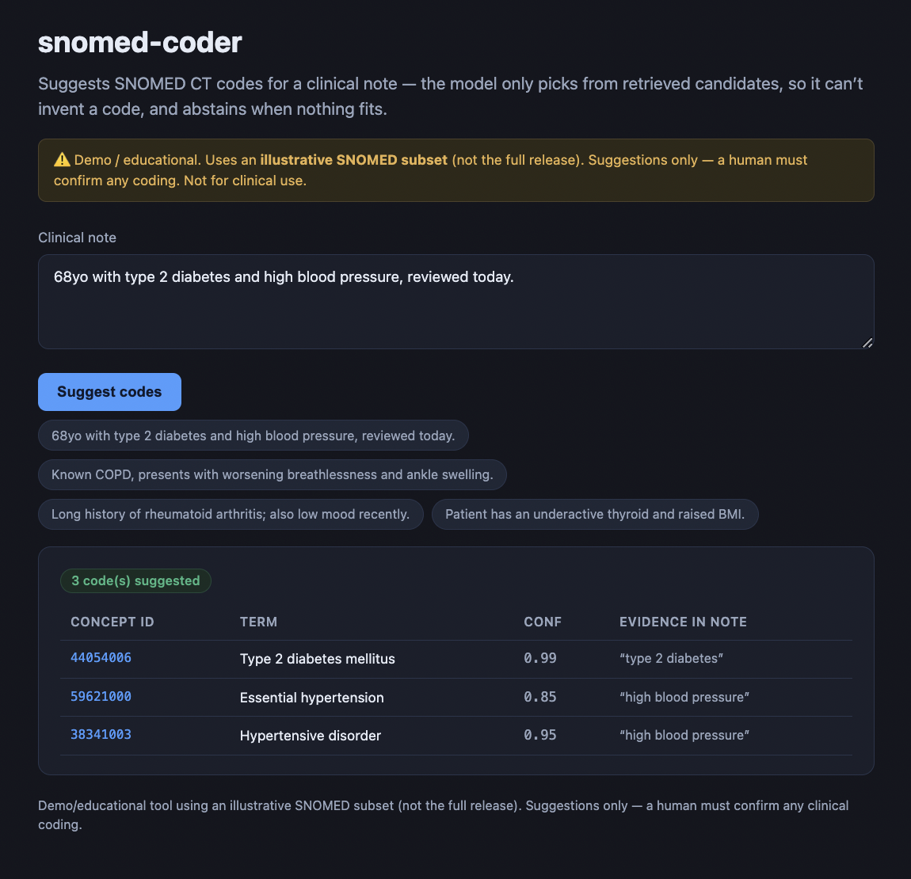
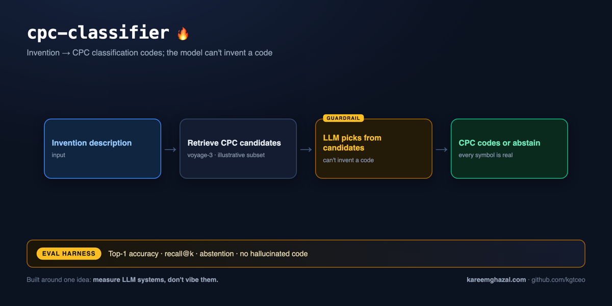

# cpc-classifier

### ▶ Live demo: **[cpc-classifier.kareemghazal.com](https://cpc-classifier.kareemghazal.com)**

Paste an invention description and get suggested **CPC (Cooperative Patent Classification)** classes
with the supporting phrase — or an abstention when nothing fits. The model can only pick from
retrieved candidates, so it can't invent a symbol. (First run ~10–20s.)



**How it works** — input → pipeline → output, with the eval harness that measures it:



> **Demo / educational — not a substitute for a professional classification search.** Uses a small
> **illustrative CPC subset** (not the full CPC scheme). Output is classification *suggestions* for a
> human to confirm. The bundled `cpc_subset.json` is a handful of illustrative classes across common
> CPC areas — it is NOT the official CPC scheme and is not maintained against CPC revisions.

Suggests **CPC classes** for a free-text invention description — built so the LLM **can't hallucinate
a symbol**. Classification symbols are a classic failure mode for LLMs (they'll happily emit a
plausible, wrong symbol), so this tool never lets the model produce one from memory.

How it stays safe:

1. **Retrieval first.** The invention is embedded and matched against the CPC subset — this produces
   a shortlist of **candidate classes** (real symbols + titles).
2. **The LLM only *chooses*.** It's shown the candidates and picks the ones the invention falls
   under, with a confidence and the evidence phrase from the description. It's told it may only use
   the given symbols.
3. **Validation enforces it.** After selection, any symbol that wasn't in the retrieved candidates is
   **dropped** — so even if the model invents one, it can't reach the output. The title is normalised
   back to the canonical subset title.
4. **Abstains** when nothing confidently fits, rather than forcing a weak match.

## Architecture

```
invention ─▶ Voyage embed ─▶ cosine search over CPC subset ─▶ candidate classes
                                                                     │
                                                                     ▼
                                                   LLM selects from candidates only
                                                                     │
                                          validate symbols ⊆ candidates ─▶ ClassificationResult
```

## Quickstart

```bash
pip install -e .
cp .env.example .env   # add ANTHROPIC_API_KEY + VOYAGE_API_KEY

cpc-classifier classify "A wearable sensor that measures blood glucose and streams readings to a phone"
```

## Evals

```bash
python evals/run_evals.py
```

- **Top-1 accuracy** — the highest-confidence pick is a correct class.
- **Recall@k** — expected classes appear among the selections.
- **Abstention** — non-classifiable inputs (e.g. "a recipe for sourdough bread") are refused.
- **No-hallucinated-symbol** — every selected symbol exists in the bundled subset (the core guarantee).

**Latest run (claude-sonnet-4-6, voyage-3 embeddings):** all gates pass — **TOP-1 accuracy 5/5** and
recall@k **1.00** across the classifiable inventions (automotive→B60W, cryptography→H04L 9/00,
wearable→A61B 5/00…), correct **abstention** on a non-classifiable input, and every selected symbol
exists in the bundled subset (no hallucinated code).

## Tests

```bash
pytest -q   # offline: CPC class index + the anti-hallucination guarantee (fake embedder + client)
```

The key test proves that when the model returns a symbol that wasn't retrieved, the classifier drops it.

## Web

`web/` — a Next.js UI: paste an invention description, get suggested CPC classes with the evidence
phrase, or an honest abstention.

Run it locally in two terminals:

```bash
# terminal 1 — the API
pip install -e .
cp .env.example .env                  # add ANTHROPIC_API_KEY and VOYAGE_API_KEY
python -m uvicorn cpc_classifier.api:app --port 8000

# terminal 2 — the UI
cd web
npm install
echo "NEXT_PUBLIC_API_URL=http://localhost:8000" > .env.local
npm run dev                           # open http://localhost:3000
```

See [DEPLOY.md](./DEPLOY.md).

## License

MIT — see [LICENSE](./LICENSE).
